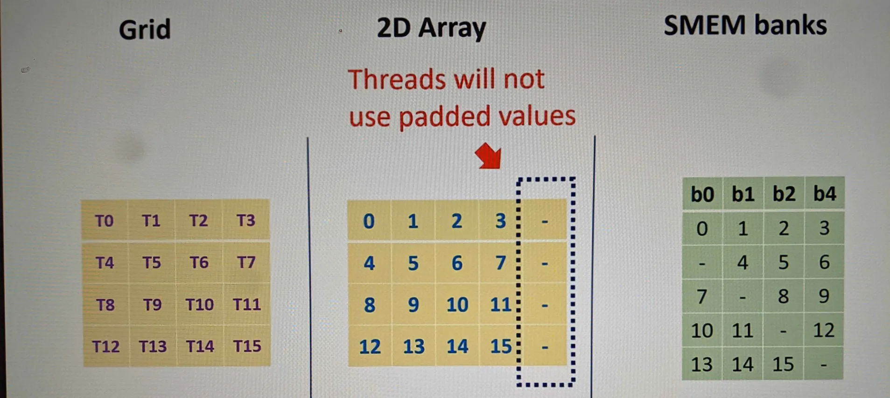
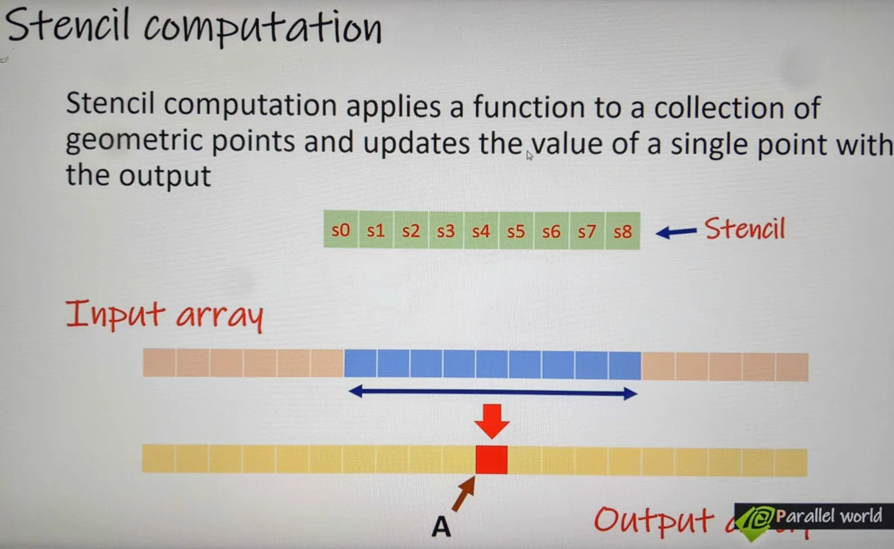

# **Introduction to CUDA Shared Memory**

In CUDA programming, memory access patterns significantly impact performance. Depending on the nature of the algorithm, **misaligned** and **non-coalesced** memory accesses might be unavoidable. In such cases, **shared memory** can be used to optimize kernel performance and reduce latency.

## **Types of Memory in CUDA**
CUDA categorizes memory into two main types based on their location and latency:

### **1. On-Board Memory (High Latency)**  
   - **L2 Cache**: Moderates access between the GPU cores and global memory.  
   - **Global Memory**:  
     - High latency (~400–800 cycles) but large capacity.  
     - Accessed by all threads across all blocks.  

### **2. On-Chip Memory (Low Latency)**  
   - **Shared Memory**:  
     - On-chip and very close to streaming multiprocessors (SMs).  
     - Significantly lower latency compared to global memory.  
     - Capacity is **limited** (depends on GPU microarchitecture).  
     - **Warning:** Excessive shared memory usage per block can reduce the number of concurrently resident thread blocks per SM, thereby lowering kernel **occupancy** (percentage of active threads per SM).  

   - **L1 Cache**: Provides fast access but is not user-programmable.  
   - **Read-Only Cache**: Optimized for read-only data, typically accessed by `__restrict__` pointers.  
   - **Constant Memory**: Specialized cache for constant data shared by all threads.

---

## **Shared Memory: Common Use Cases**
Shared memory is a powerful resource for improving performance in CUDA programs. It serves several critical roles:

1. **Intra-block Thread Communication**  
   Threads within a block can use shared memory to exchange data efficiently without needing to access slower global memory.

2. **Program-managed Cache for Global Memory**  
   Shared memory can temporarily store frequently accessed global memory data, reducing latency and improving overall memory access efficiency.

3. **Scratch Pad Memory**  
   It is used to transform or reorganize data into formats that facilitate coalesced global memory accesses, improving bandwidth utilization.

---

## **Shared Memory Characteristics**
- A fixed amount of shared memory is allocated to each thread block upon its execution.  
- The shared memory is **shared by all threads within a thread block**, and its lifetime is tied to the block's execution duration.  
- Shared memory transactions are issued at the warp level:  
  - **Optimal Case:** All threads in a warp access memory addresses within the same 32-byte segment (single transaction).  
  - **Worst Case:** Memory access patterns are scattered, requiring **32 separate transactions**.

**Note:** Unlike L1 cache, which is automatic and hardware-managed, shared memory is **programmable**, allowing developers to explicitly store and reuse data.

---

## **Example: Using Shared Memory**

### **Static Shared Memory Declaration**
Static shared memory is declared at compile time using the `__shared__` keyword.

```c
__global__ void smem_static_test(int* in, int* out, int size) {
    int tid = threadIdx.x; // Thread index within block
    int gid = blockIdx.x * blockDim.x + threadIdx.x; // Global thread index

    // Declare a statically allocated shared memory array
    __shared__ int smem[SHARED_MEMORY_ARRAY_SIZE];

    // Check boundary conditions
    if (gid < size) {
        // Load data into shared memory
        smem[tid] = in[gid];
        // Perform operations and write back to global memory
        out[gid] = smem[tid];
    }
}
```

### **Dynamic Shared Memory Declaration**
Dynamic shared memory is declared at runtime using the `extern __shared__` modifier.

```c
__global__ void smem_dynamic_test(int* in, int* out, int size) {
    int tid = threadIdx.x; // Thread index within block
    int gid = blockIdx.x * blockDim.x + threadIdx.x; // Global thread index

    // Declare dynamically allocated shared memory
    // or this can be a pointer like: `extern __shared__ int* smem;`
    extern __shared__ int smem[];

    // Check boundary conditions
    if (gid < size) {
        // Load data into shared memory
        smem[tid] = in[gid];
        // Perform operations and write back to global memory
        out[gid] = smem[tid];
    }
}
```

### **Key Differences**
1. **Static Shared Memory**:  
   - Size is fixed at compile time and specified in the kernel code.  
   - Best for predictable, small-sized allocations.
   - Launch: `smem_static_test<<<grid, block>>>(d_in, d_out, size);`

2. **Dynamic Shared Memory**:  
   - Size is specified during kernel launch using the third kernel parameter (e.g., `<<<blocks, threads, shared_mem_size>>>`).
        * `smem_dynamic_test<<<grid, block, sizeof(int) * SHARED_MEMORY_SIZE>>>(d_in, d_out, size);`
   - Useful for variable or larger memory requirements.

---

## **Best Practices for Shared Memory Usage**
1. **Minimize Shared Memory Usage**  
   Over-allocating shared memory can reduce SM occupancy, degrading overall performance. Balance memory usage and active threads.

2. **Align Memory Access**  
   Ensure threads access contiguous addresses in shared memory to maximize memory bandwidth and reduce access latency.

3. **Avoid Bank Conflicts**  
   Shared memory is divided into banks. Avoid threads accessing the same bank simultaneously to prevent serialization.

4. **Combine with Registers**  
   Use registers for frequently accessed variables to further reduce memory access overhead.

5. **Leverage Dynamic Allocation Judiciously**  
   Use dynamic shared memory only when static allocation is insufficient or when sizes vary across kernel launches.

-----

# **Shared Memory Banks and Access Modes**

In CUDA, shared memory is divided into **banks** to allow parallel access by threads in a warp. Efficient utilization of shared memory depends on understanding how these banks function and avoiding conflicts that can degrade performance.

---

## **Shared Memory Banks**

Shared memory is divided into **32 equally sized memory modules**, called **banks**, which can be accessed simultaneously. Each bank serves one 32-bit or 64-bit word per cycle, depending on the GPU's compute capability.

### **Bank Layout and Word Indices**
- Banks are sequentially indexed from **0 to 31**.  
- Each bank contains a series of memory words. A **word** is a fixed-size data unit (e.g., 4 bytes for 32-bit words or 8 bytes for 64-bit words).  

#### **Example Layout: 32-bit Banks**
```
Bank Index:         0 ----- 31
=================================
4-Byte Word Index:  0 ----- 31
                    32 ---- 63
                    64 ---- 95
                    96 ---- 127
```

### **Relationship Between Banks and Warps**
Since there are **32 threads per warp**, each thread in a warp can access one bank simultaneously without conflict if the memory access pattern is properly aligned.

---

## **Bank Conflicts**

A **bank conflict** occurs when multiple threads in a warp attempt to access **different words within the same bank** in a single transaction. When this happens:
- The memory request is split into multiple **conflict-free transactions**.
- The number of transactions equals the degree of the conflict (i.e., how many threads access the same bank).  
- This reduces effective bandwidth and slows down kernel execution.

---

### **Common Access Scenarios in Shared Memory**

1. **Ideal Case: Parallel Access**
   - If all threads access **different banks**, the access occurs in a single transaction.  
   - This is the optimal pattern for shared memory usage, ensuring maximum bandwidth utilization.

2. **Sequential Access**
   - Threads access **different memory addresses** within the **same bank**.  
   - The memory accesses are serialized, degrading performance due to conflicts.

3. **Broadcast Access**
   - All threads access the **same memory address** within a single bank.  
   - The transaction is serialized but only one word is actually read. This leads to poor bandwidth utilization as many threads effectively do no useful work.

---

## **Shared Memory Bank Width and Access Modes**

The width of each bank determines how data is mapped to banks and accessed by threads.  

### **Bank Width Evolution**
- **Compute Capability 2.x GPUs**: 32-bit banks (4 bytes per word).  
- **Compute Capability 3.x and later GPUs**: 64-bit banks (8 bytes per word).  

### **Shared Memory Access Modes**
CUDA supports two primary access modes for shared memory:
1. **32-bit Access Mode:** Each thread accesses a 4-byte word.  
2. **64-bit Access Mode:** Each thread accesses an 8-byte word.  

---

## **Calculating Bank Index**

The **bank index** determines which bank a specific memory address is mapped to. For devices with 32-bit banks:
```plaintext
bank_index = (byte_address / (4 bytes per word)) % 32
```

---

## **Examples**

### **Example 1: Fermi Devices (32-bit Bank Width)**

On devices with 32-bit banks, successive 4-byte memory words are mapped to successive banks:

#### Layout:
```
Byte Address:          0 | 4 | 8 | 12 | ---- | 60 | .......
4-Byte Word Index:     0 | 1 | 2 | 3  | ---- | 15 | .......
Bank Index:            0 | 1 | 2 | 3  | ---- | 31 | .......
```

#### Memory Mapping:
```
Bank Index:         0 ----- 31
=================================
4-Byte Word Index:  0 ----- 31
                    32 ---- 63
                    64 ---- 95
                    96 ---- 127
```

---

### **Example 2: 64-bit Bank Width, 32-bit Access Mode**

On devices with 64-bit banks, successive **4-byte memory words** are mapped to **successive banks**. Each bank serves two 4-byte words:

#### Layout:
```
|  B1  |  B2  |  B3  |  B4  |  B5  | .............  |  B31  |
| 0,32 | 1,33 | 2,34 | 3,35 | 4,36 | .............  | 31,63 |
```

---

### **Example 3: 64-bit Bank Width, 64-bit Access Mode**

For 64-bit access, successive **8-byte memory words** are mapped to successive banks. Each bank serves one 8-byte word:

#### Layout:
```
|  B1  |  B2  |  B3  |  B4  |  B5  | .............  |  B31  |
| 0,2  | 3,4  | 5,6  | 7,8  | 9,10 | .............  | 62,63 |
```

---

## **Best Practices for Avoiding Bank Conflicts**

1. **Align Access Patterns**  
   Ensure threads in a warp access sequential addresses to map to different banks. This avoids conflicts and maximizes bandwidth.

2. **Pad Shared Memory Arrays**  
   Add padding to shared memory arrays to disrupt conflict-prone patterns. For example:
   ```c
   __shared__ int smem[32 + 1];  // Extra padding avoids conflicts
   ```

3. **Minimize Shared Memory Accesses**  
   Use shared memory judiciously and combine it with registers for frequently accessed data.

4. **Understand Device Architecture**  
   Be aware of the GPU's compute capability and adjust shared memory access modes accordingly.

-----

# **Row Major vs. Column Major Accesses in Shared Memory**

When working with CUDA shared memory, the access pattern to a 2D grid (or matrix) significantly affects performance due to the organization of memory banks. Understanding row-major and column-major access patterns is crucial to avoid bank conflicts and optimize memory throughput.

---

## **Matrix Organization and Initialization**

Consider a **32x32 matrix** initialized in **row-major order**, where:
- **Row-major order**: Elements are stored sequentially row by row.
- Starting from `0`, each element's value increments by `1`.

### **Matrix Layout in Shared Memory**
Assume a **32-bit bank width** (each bank stores 4-byte words). The matrix is laid out in shared memory as follows:

#### Memory Banks (32 Banks Total):
```
|  B1  |  B2  |  B3  |  B4  |  B5  | ............ |  B32  |
   0      1       2      3      4                     31
   .....................................................
   .....................................................
   .....................................................
   992    993    994    995    996                   1023
```

- **Rows** are stored contiguously in memory.  
- Each **row** is spread across all 32 memory banks.  
- The first 32 elements map to the first bank cycle, the next 32 elements to the next cycle, and so on.

---

## **Access Patterns: Row-Major vs. Column-Major**

### **1. Row-Major Access**
When accessing the matrix row by row:
- **Each thread in a warp** accesses a unique element in the same row.  
- These elements are mapped to **different memory banks**.  
- This ensures **no bank conflicts**, and the access is serviced in a **single memory transaction**.

#### Example: Row-Major Access by Warp
For **warp 0** accessing the first row:
```
Thread 0 -> Element 0 (Bank 0)
Thread 1 -> Element 1 (Bank 1)
Thread 2 -> Element 2 (Bank 2)
...
Thread 31 -> Element 31 (Bank 31)
```
- Result: Fully parallel access with optimal bandwidth utilization.

---

### **2. Column-Major Access**
When accessing the matrix column by column:
- **Each thread in a warp** accesses elements from the same column across multiple rows.  
- All these elements are mapped to the **same memory bank**.  
- This causes a **bank conflict**, as all threads attempt to access the same bank simultaneously.  
- CUDA hardware resolves this by serializing the requests, requiring **32 separate transactions per warp**.

#### Example: Column-Major Access by Warp
For **warp 0** accessing the first column:
```
Thread 0 -> Element 0 (Bank 0)
Thread 1 -> Element 32 (Bank 0)
Thread 2 -> Element 64 (Bank 0)
...
Thread 31 -> Element 992 (Bank 0)
```
- Result: **32 bank conflicts**, reducing bandwidth utilization and increasing latency.

---

## **Impact of Access Patterns on Performance**

1. **Row-Major Access:**
   - Accesses are aligned with the shared memory bank structure.
   - Single memory transaction per warp.
   - Ideal for memory-intensive operations where performance is critical.

2. **Column-Major Access:**
   - Causes severe bank conflicts, reducing performance.
   - Each warp requires multiple serialized transactions, increasing kernel execution time.

---

## **How to Avoid Bank Conflicts in Column-Major Access**

If column-major access is unavoidable, **padding** can be used to disrupt conflict patterns:
- Introduce an extra column of padding between rows in shared memory.  
- This shifts the bank index of each column, reducing conflicts.

### **Example: Padding to Avoid Conflicts**
For a 32x32 matrix:
```c
__shared__ int smem[32][33];  // Add 1 column of padding
```
- The extra column ensures that successive rows are no longer mapped to the same banks.

---

## **Key Takeaways**
1. **Understand Memory Layout**: Row-major storage aligns with CUDA’s shared memory bank structure, while column-major storage often leads to conflicts.
2. **Align Access Patterns**: Ensure threads access memory in ways that minimize conflicts.
3. **Use Padding**: Add padding to disrupt conflict-prone access patterns in column-major layouts.

-----

# Static and Dynamic Shared Memory

Use:
- `row_index = threadIdx.y * blockDim.x + threadIdx.x` 
- `col_index = threadIdx.x * blockDim.y + threadIdx.y`

See `dynamicRowMajorDemo.cu`

-----

# Shared Memory Padding



For code see `smemPaddingDemo.cu`

-----

# **CUDA Synchronization Mechanism**

CUDA uses a **weakly ordered memory model**, which means the order in which a thread writes data to shared, global, or other memory spaces may not be observed in the same order by other threads. This characteristic enables high performance but can lead to inconsistencies if not properly managed.

---

## **Memory Ordering in CUDA**

### **Weakly Ordered Model**
- The order of operations performed by one thread **may not be visible** to other threads in the same order.
- Example:
  - A thread writes `x = 10` followed by `y = 20`.
  - Another thread reading `x` and `y` may see:
    - `x = 1, y = 2` (initial values).
    - `x = 10, y = 2`.
    - `x = 10, y = 20`.
    - OR even `x = 1, y = 20` (since there's no guaranteed ordering).

### **Strongly Ordered Model**
In a strongly ordered model, threads always observe memory operations in the order they were performed. CUDA does not natively enforce this, but you can introduce **memory fences** to impose ordering constraints.

---

## **Example Code**

```cpp
__device__ volatile int x = 1, y = 2;

// Writing values to x and y
__device__ void writeXY() {
   x = 10;  // First write
   y = 20;  // Second write
}

// Reading values from x and y
__device__ void readXY() {
   int p = x;  // Read x
   int q = y;  // Read y
}
```

In the example:
- Without synchronization, thread B may see the writes to `x` and `y` in **any order**, due to the weakly ordered memory model.

---

## **Memory Fence Functions**

CUDA provides **memory fence functions** to enforce memory ordering:

### **1. `__threadfence_block()`**
- Scope: **Thread block**.
- Ensures:
  - **All writes** to memory made by a thread before this function call are observed by other threads in the same block **before any writes** after this function call.
  - **All reads** made before this function call are ordered before **all reads** made after this function call.
- Use case: Synchronize memory access within the same block.

#### **Example**
```cpp
__global__ void threadFenceBlockExample() {
    __shared__ int sharedVar;
    
    // Thread 0 writes to shared memory
    if (threadIdx.x == 0) {
        sharedVar = 42;
        __threadfence_block(); // Ensure the write is visible to all threads in the block
    }

    // Other threads read sharedVar
    __syncthreads(); // Synchronize all threads in the block
    int value = sharedVar; // Guaranteed to see 42 after __threadfence_block()
}
```

---

### **2. `__threadfence()`**
- Scope: **Device**.
- Ensures:
  - Same guarantees as `__threadfence_block()`, but across the entire device.
  - Useful when threads in different blocks need to observe memory operations in a specific order.

#### **Example**
```cpp
__global__ void threadFenceDeviceExample(int* globalVar) {
    if (threadIdx.x == 0) {
        *globalVar = 42;       // Write to global memory
        __threadfence();       // Ensure visibility across the device
    }

    // Other threads or blocks can now safely read *globalVar
}
```

---

## **Key Concepts**

### **1. Memory Coherence**
- Without synchronization, different threads may observe memory updates in **different orders**.
- Memory fences ensure **memory coherence** within the specified scope.

### **2. Synchronization vs. Memory Fence**
- **Thread synchronization (`__syncthreads()`)**: Ensures all threads in a block reach the same point before proceeding.
- **Memory fence (`__threadfence_block()` or `__threadfence()`)**: Ensures ordering of memory operations before and after the fence call.

---

## **Comparison of Memory Fence Functions**

| Function             | Scope           | Use Case                          |
|----------------------|-----------------|-----------------------------------|
| `__threadfence_block()` | Thread block    | Synchronize memory writes within a thread block. |
| `__threadfence()`       | Device          | Ensure memory writes are visible to all threads across the device. |

---

## **Best Practices**

1. **Use Synchronization Wisely**:
   - Overuse of memory fences can degrade performance.
   - Use them only when absolutely necessary to maintain memory consistency.

2. **Combine with `__syncthreads()`**:
   - Memory fences ensure **ordering**, while `__syncthreads()` ensures all threads reach a consistent point in execution.

3. **Scope Matters**:
   - Use `__threadfence_block()` for intra-block consistency.
   - Use `__threadfence()` for inter-block consistency.

---

## **Summary**

- CUDA uses a **weakly ordered memory model** for performance reasons.
- **Memory fences** like `__threadfence_block()` and `__threadfence()` allow you to enforce memory ordering.
- Proper use of synchronization mechanisms is crucial for ensuring correctness in parallel programs while avoiding unnecessary performance overhead.

-----

# **Matrix Transpose with Shared Memory**

Matrix transpose involves swapping rows and columns. In CUDA, **shared memory** optimizes this process by reducing global memory accesses and improving memory access patterns.

---

## **Assumption**
- The **matrix** and **thread block dimensions** are non-equal.
- Shared memory is used as a staging area to store tiles of the input matrix for optimized memory access during the transpose operation.

---

## **Memory Access Patterns**

### **1. Access Input Array in Row-Major Format**
Each thread accesses an element from the **input matrix** stored in row-major order:
- **Index calculations:**
  - Global indices for the thread:
    ```cpp
    ix = blockIdx.x * blockDim.x + threadIdx.x; // Global column index
    iy = blockIdx.y * blockDim.y + threadIdx.y; // Global row index
    ```
  - Linear index for input array:
    ```cpp
    in_index = iy * nx + ix; // Row-major indexing
    ```

---

### **2. Store Data to Shared Memory in Row-Major Format**
The element read from the input matrix is stored in **shared memory** in row-major format:
- **Index calculation:**
  - Use thread indices to determine shared memory tile coordinates:
    ```cpp
    tile[threadIdx.y][threadIdx.x] = input[in_index];
    ```

- **Purpose**:
  - Staging data in shared memory allows threads to later access it efficiently in column-major order for the transposed matrix.

---

### **3. Load Data from Shared Memory in Column-Major Format**
To transpose the matrix, threads load data from the **shared memory** in column-major order:
- **Index calculations:**
  - Calculate a **1D thread index** in the tile:
    ```cpp
    1d_index = threadIdx.y * blockDim.x + threadIdx.x;
    ```
  - Derive the **row** and **column** indices for column-major access:
    ```cpp
    i_row = 1d_index / blockDim.y; // Row index in transposed view
    i_col = 1d_index % blockDim.y; // Column index in transposed view
    ```
  - Access shared memory:
    ```cpp
    value = tile[i_col][i_row];
    ```

---

### **4. Store Data to Output Array in Row-Major Format**
The transposed data is written back to the **output array** in row-major format:
- **Index calculations:**
  - Calculate the transposed global indices:
    ```cpp
    out_ix = blockIdx.y * blockDim.y + i_col; // Transposed column index
    out_iy = blockIdx.x * blockDim.x + i_row; // Transposed row index
    ```
  - Linear index for the output array:
    ```cpp
    out_index = out_iy * ny + out_ix;
    ```
  - Write to the output array:
    ```cpp
    output[out_index] = value;
    ```

---

## **Flow Diagram**

1. **Input Matrix (Row-Major Format)**
   - Data is read using global indices and stored in shared memory.

2. **Shared Memory (Row-Major Format)**
   - Acts as a staging area, allowing efficient access patterns.

3. **Shared Memory (Column-Major Format)**
   - Data is read from shared memory in a column-major pattern to achieve the transpose.

4. **Output Matrix (Row-Major Format)**
   - Transposed data is written back to the output matrix in row-major order.

---

## **Summary**
- Efficient indexing and shared memory usage allow for reduced global memory operations and improved performance.
- The key operations involve:
  - Reading data into shared memory.
  - Accessing shared memory with transposed indices.
  - Writing the transposed result to the global memory.

-----

# **Constant Memory in CUDA**

Constant memory is a **special-purpose memory** in CUDA that is:
- **Read-only** from the device (kernels).
- **Readable and writable** from the host (CPU).

It is designed for **read-only data** that is accessed uniformly by threads within a warp, offering performance benefits in specific scenarios.

---

## **Key Characteristics of Constant Memory**

1. **Uniform Access**:
   - Best suited for data that is accessed **uniformly by all threads in a warp** (e.g., a common coefficient or lookup table).
   - When all threads in a warp access the **same memory location**, the access is optimized and broadcasted to all threads in a single transaction.

2. **Serialized Access**:
   - If threads within a warp access **different addresses** in constant memory, the accesses are serialized, leading to reduced performance.

3. **Lifetime and Accessibility**:
   - **Lifetime**: Constant memory variables exist for the duration of the application.
   - **Accessibility**: Accessible from:
     - All threads in a grid.
     - The host (CPU) via CUDA runtime functions.

4. **Initialization**:
   - Constant memory can only be **read** from the device.
   - Values must be **initialized from the host** using runtime functions like `cudaMemcpyToSymbol`.

---

## **Declaring and Using Constant Memory**

### **Declaration**
- Use the `__constant__` keyword to declare constant memory in global scope:
  ```c
  __constant__ float coefficients[256];
  ```

### **Copying Data from Host to Device**
- Use `cudaMemcpyToSymbol` to copy data to constant memory:
  ```c
  cudaMemcpyToSymbol(
      coefficients,    // Symbol (constant memory variable)
      host_data,       // Source data on host
      sizeof(float) * 256, // Size of data to copy
      0,               // Offset in constant memory (optional)
      cudaMemcpyHostToDevice // Direction of memory copy
  );
  ```

### **Accessing Constant Memory in Kernel**
- Constant memory can be directly accessed within the kernel using its name:
  ```c
  __global__ void computeKernel(const float* input, float* output, int size) {
      int idx = threadIdx.x + blockIdx.x * blockDim.x;
      if (idx < size) {
          output[idx] = input[idx] * coefficients[0]; // Access constant memory
      }
  }
  ```

---

## **Performance Tips**

1. **Uniform Access**:
   - Ensure all threads in a warp access the **same address** in constant memory to maximize performance.

2. **Data Size**:
   - Constant memory is limited to **64 KB** for most devices.
   - Use it for small, read-only datasets that are frequently accessed.

3. **Initialization from Host**:
   - Always initialize constant memory values from the host before launching kernels.

---

## **Application: Stencil Computations**

### **What are Stencil Computations?**
- Stencil computations involve applying a **function** to a group of **geometric points** (e.g., a neighborhood in a grid) and updating the value of a single point based on the results.
- Examples include:
  - Heat diffusion simulation.
  - Image processing filters (e.g., Gaussian blur).
  - Finite difference methods for solving PDEs.

### **Constant Memory Usage in Stencil Computations**
- Constant memory is ideal for storing **stencil coefficients** (e.g., weights in a kernel):
  ```c
  __constant__ float stencil[5]; // Stencil coefficients

  __global__ void stencilKernel(const float* input, float* output, int width) {
      int idx = threadIdx.x + blockIdx.x * blockDim.x;
      if (idx >= 2 && idx < width - 2) { // Avoid boundary issues
          output[idx] = stencil[0] * input[idx - 2] +
                        stencil[1] * input[idx - 1] +
                        stencil[2] * input[idx] +
                        stencil[3] * input[idx + 1] +
                        stencil[4] * input[idx + 2];
      }
  }
  ```

### **Advantages**:
- Stencil coefficients are **read-only** and shared across all threads, making them a perfect fit for constant memory.
- Reduces the need for repetitive global memory reads, improving performance.

---

## **Summary**

### **Why Use Constant Memory?**
- Ideal for small, read-only datasets shared across threads.
- Maximizes performance when accessed uniformly by threads in a warp.

### **When to Use Constant Memory?**
- Frequently accessed, read-only data such as:
  - Coefficients in stencil computations.
  - Lookup tables.
  - Fixed constants for computations.

### **Limitations**
- Limited to **64 KB** in size.
- Access performance drops if threads in a warp access **different addresses**.



-----

# **Warp Shuffle Instructions**

**Warp shuffle instructions** provide a mechanism for threads within a warp to directly exchange data using registers, without the need for shared memory. This feature:
- **Reduces latency** compared to shared memory.
- **Eliminates the need for additional memory allocation** for data exchange.

### **Key Characteristics**
- Threads can exchange data directly via registers.
- Operates **only within a warp** (32 threads).
- Has lower latency than shared memory operations.

---

## **Available Warp Shuffle Functions**

CUDA provides several shuffle instructions, each serving a specific purpose:

1. **`__shfl_sync()`**
   - Allows a thread to read a value from a register in another thread.

2. **`__shfl_up_sync()`**
   - Performs an upward shuffle within a warp.
   - Each thread gets the value of a thread with a lower lane ID.

3. **`__shfl_down_sync()`**
   - Performs a downward shuffle within a warp.
   - Each thread gets the value of a thread with a higher lane ID.

4. **`__shfl_xor_sync()`**
   - Performs a shuffle based on XOR of the thread's lane ID.
   - Useful for performing reductions and data patterns across a warp.

---

## **Typical Syntax**

```c
__shfl_x(mask, variable, source_lane_id, width);
```

### **Parameters**:
- **`mask`**:
  - Specifies the threads participating in the shuffle.
  - Use `0xFFFFFFFF` for all threads in a warp.
- **`variable`**:
  - The variable to be exchanged.
- **`source_lane_id`**:
  - The source thread's lane ID (0–31) from which data is read.
  - `laneID = threadIdx.x % 32`
- **`width`**:
  - The number of threads participating in the shuffle operation.
  - Default width for a warp is `32`.

---

## **Examples**

### **1. Basic Data Exchange**
```cpp
int value = threadIdx.x; // Each thread gets its index
int shuffled_value = __shfl_sync(0xFFFFFFFF, value, 5, 32);

// Thread 5's value is broadcasted to all threads in the warp.
```

### **2. Upward Shuffle**
```cpp
int value = threadIdx.x; // Each thread gets its index
int shuffled_value = __shfl_up_sync(0xFFFFFFFF, value, 1, 32);

// Each thread gets the value of the thread one lane below.
```

### **3. Downward Shuffle**
```cpp
int value = threadIdx.x; // Each thread gets its index
int shuffled_value = __shfl_down_sync(0xFFFFFFFF, value, 1, 32);

// Each thread gets the value of the thread one lane above.
```

### **4. XOR Shuffle**
```cpp
int value = threadIdx.x; // Each thread gets its index
int shuffled_value = __shfl_xor_sync(0xFFFFFFFF, value, 1, 32);

// Data is exchanged between threads based on XOR of lane IDs.
```

---

## **Use Cases**

### **1. Reduction Operations**
- Warp shuffle instructions simplify and optimize reduction operations (e.g., sum, min, max).
- Example: Sum all values in a warp.
  ```cpp
  int value = threadIdx.x; // Example value
  for (int offset = 16; offset > 0; offset /= 2) {
      value += __shfl_down_sync(0xFFFFFFFF, value, offset, 32);
  }
  // Result: Each thread in the warp now holds the total sum of all values.
  ```

### **2. Data Rearrangement**
- Allows threads to rearrange data efficiently without using shared memory.

### **3. Prefix Sum (Scan)**
- Shuffle instructions can be used for intra-warp scans.

---

## **Performance Considerations**

1. **Latency**:
   - Shuffle instructions have lower latency than shared memory.

2. **Scalability**:
   - Only operates within a warp (32 threads). For operations across warps, shared memory or global memory is needed.

3. **Mask Parameter**:
   - Use masks judiciously to avoid unintended results. For all threads in a warp, use `0xFFFFFFFF`.

---

## **Key Takeaways**
- Warp shuffle instructions enable efficient, low-latency data exchange within a warp.
- Suitable for operations like reductions, scans, and rearrangements.
- Use when thread communication is confined to a warp for better performance compared to shared memory.