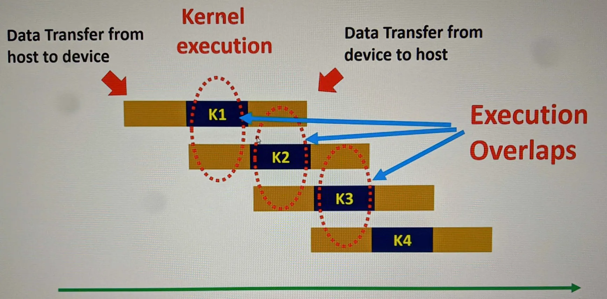

# **CUDA Streams and Events**

In CUDA programming, we often follow a basic model for structuring program execution:

### **Kernel-Level Parallelism**
```
Data Transfer: Host → Device  -->  Kernel Execution  -->  Data Transfer: Device → Host
--------------------------------------------------------------------------------------> (Time)
```

While effective, this model can be limiting in terms of performance optimization, as the different stages of execution are sequentially dependent.

---

## **Grid-Level Concurrency/Parallelism**

To maximize concurrency, we can execute multiple kernels simultaneously on the same device while overlapping memory transfers with kernel execution.



### **Optimized Approach**
What if we:
1. Partition the data.
2. Transfer one partition to the device and execute the kernel on it.
3. Simultaneously transfer the next partition while the kernel is still executing.

This overlapping of memory transfer and kernel execution reduces overall execution time.

### **Requirements for Overlap**
To enable such concurrency:
1. We need a way to **launch multiple kernels** on the same device.
2. We need **asynchronous memory transfer mechanisms**.

---

## **CUDA Streams**

A **stream** is a sequence of commands (kernel executions, memory transfers, etc.) that execute in order.  
Commands in **different streams** can:
- Execute **out of order** relative to each other.
- Execute **concurrently**, depending on hardware capabilities.

---

## **Synchronous vs. Asynchronous Function Calls**

From the **host's perspective**:
- **Synchronous Functions**: Block the host thread until the operation completes.
- **Asynchronous Functions**: Return control to the host immediately after the function call, allowing further operations to proceed.

### Example
```cpp
kernel1<<<grid, block, 0, stream1>>>();
kernel2<<<grid, block>>>();  // Default (null) stream
kernel3<<<grid, block, 0, stream2>>>();
```

#### Observations:
1. Three kernels (`kernel1`, `kernel2`, and `kernel3`) are launched in separate streams (`stream1`, default stream, and `stream2`).
2. From the **host's perspective**, all these launches are **asynchronous**—the host does not wait for them to complete.
3. From the **device's perspective**, execution depends on the relationship between `stream1`, `stream2`, and the null stream:
   - Commands in the null stream **synchronize** with other streams by default.
   - Commands in `stream1` and `stream2` can potentially execute concurrently if the device supports it.

---

## **NULL Stream (Default Stream)**

The **null stream** is the default stream used for kernel launches and data transfers if no stream is explicitly specified. It has unique behavior:
- **Synchronizes** with commands in other streams.
- Often serves as a synchronization mechanism between multiple streams.

---

## **Concurrency-Enabled Tasks in CUDA**

The following tasks can operate concurrently, subject to hardware capabilities:
1. Computations on the **host**.
2. Computations on the **device**.
3. Memory transfers **Host → Device**.
4. Memory transfers **Device → Host**.
5. Memory transfers **within device memory**.
6. Memory transfers **across devices**.

---

### **Concurrency Visualization**
Consider the following overlap model:

```text
Memory Transfer: Host → Device  (Stream 1)        ---------------------
Kernel Execution 1 (Stream 1)                     ---------------------
Memory Transfer: Host → Device  (Stream 2)        ---------------------
Kernel Execution 2 (Stream 2)                     ---------------------
```

Commands in **different streams** can execute concurrently, reducing bottlenecks and optimizing overall performance.

-----

# Asynchronous Functions

To transfer data asynchronously, use
```c
cudaMemCpyAsync(
    destination_pointer,            <- This should be Pinned Memory
    source_pointer,
    size,
    memory_copy_direction,
    stream
);
```

**Note:** To perform asynchronous memeory transfers, CUDA run time need the gurantee that the operating system will not move the virtual memory that belongs to the memory being copied in the middle of the memory transfer operation. Therefore, we have to use pinned memory with the above function. If we used unpinned memory, then this memory transfer will be a synchronous one which block the host execution.

-----

# **How to Use CUDA Streams**

### **Goal**
The primary goal of using CUDA streams is to:
1. **Overlap kernel executions** with memory transfers.
2. **Reduce overall execution time** by improving GPU utilization.

By leveraging CUDA streams, multiple operations (memory transfers, kernel executions) can occur **concurrently**, provided the hardware supports it.

For an implementation example, refer to **`cudaStreamDemo.cu`**.

---

## **Key Steps to Use Streams**

### 1. **Stream Declaration**
   ```cpp
   cudaStream_t stream;
   ```
   - A stream object must be declared using the `cudaStream_t` type.

---

### 2. **Stream Creation**
   ```cpp
   cudaStreamCreate(&stream);
   ```
   - Initializes a stream for use.
   - Every command assigned to this stream will execute in the order they are queued, independently of commands in other streams.

---

### 3. **Stream Synchronization**
   ```cpp
   cudaStreamSynchronize(stream);
   ```
   - Blocks the host program until **all operations** in the specified stream are complete.
   - Useful for ensuring that dependent operations do not proceed until previous stream commands finish.

---

### 4. **Stream Query**
   ```cpp
   cudaError_t status = cudaStreamQuery(stream);
   ```
   - **Non-blocking function** that checks the status of operations in the specified stream.
   - **Return values:**
     - `cudaSuccess`: All operations in the stream are complete.
     - `cudaErrorNotReady`: Operations in the stream are still in progress.

#### **Why Use `cudaStreamQuery`?**
- Allows you to periodically check the stream's status **without blocking host operations**, enabling more efficient utilization of host resources.

---

### 5. **Stream Destruction**
   ```cpp
   cudaStreamDestroy(stream);
   ```
   - Frees resources associated with the stream after all operations in the stream are complete.
   - Essential for preventing resource leaks.

---

## **Benefits of Using Streams**

1. **Asynchronous Memory Transfers**
   - Use `cudaMemcpyAsync` to transfer data between host and device memory in a specific stream.
   - Overlap memory transfers with kernel executions in the same or different streams.

2. **Concurrent Kernel Execution**
   - Launch multiple kernels in different streams to execute concurrently, provided the device supports concurrent kernel execution.

3. **Improved Resource Utilization**
   - Keep the GPU busy by overlapping memory operations with computation, reducing idle time.

---

## **Example Workflow with Streams**
Here’s a simple breakdown of how to use streams effectively:

**Preparation:** Check concurrent kernel execution eligibility
```c
int dev = 0;
cudaDeviceProp deviceProp;
cudaGetDeviceProperties(&deviceProp, dev);

if (devicePro.concurrentKernels == 0) {
    printf("Eligible");
}
```

1. **Initialize Streams**:
   ```cpp
   cudaStream_t stream1, stream2;
   cudaStreamCreate(&stream1);
   cudaStreamCreate(&stream2);
   ```

2. **Perform Asynchronous Operations**:
   - Transfer data to device memory and launch kernels:
     ```cpp
     cudaMemcpyAsync(d_in, h_in, size, cudaMemcpyHostToDevice, stream1);
     kernel<<<grid, block, 0, stream1>>>(d_in, d_out, size);
     cudaMemcpyAsync(h_out, d_out, size, cudaMemcpyDeviceToHost, stream1);
     ```

3. **Query Stream Status**:
   ```cpp
   if (cudaStreamQuery(stream1) == cudaErrorNotReady) {
       printf("Stream 1 is still processing.\n");
   }
   ```

4. **Synchronize Streams** (if required):
   ```cpp
   cudaStreamSynchronize(stream1);
   ```

5. **Destroy Streams**:
   ```cpp
   cudaStreamDestroy(stream1);
   cudaStreamDestroy(stream2);
   ```

---

### **Visualizing Stream Behavior**
- **Without Streams**: Sequential execution of memory transfers and kernel operations.
  ```
  [Memory Transfer Host → Device] → [Kernel Execution] → [Memory Transfer Device → Host]
  ```

- **With Streams**: Concurrent execution of operations in separate streams.
  ```
  Stream 1: [Memory Transfer Host → Device] → [Kernel Execution]
  Stream 2:                          [Memory Transfer Device → Host]
  ```

By overlapping these operations, the GPU can process tasks more efficiently, leading to reduced overall execution time.

---

### **Common Use Cases**
1. **Real-Time Data Processing**:
   - Continuous processing of data chunks in different streams.
2. **Multi-Kernel Workloads**:
   - Execute independent kernels simultaneously to utilize the GPU better.
3. **Heterogeneous Workloads**:
   - Overlap memory-bound and compute-bound tasks using streams.

-----

# **Overlapping Memory Transfer and Kernel Execution**

In CUDA programming, overlapping memory transfer and kernel execution is a crucial optimization technique to improve GPU utilization. By dividing tasks among streams and leveraging asynchronous operations, you can achieve concurrency between data movement and computation.

For a practical demonstration, refer to the folder `cudaMemKerAsyncDemo` in `codeDemo`.

---

# **Stream Synchronization and Blocking Behaviors of the NULL Stream**

---

## **Blocking Behavior of the NULL Stream**

The **NULL stream** is an implicit stream in CUDA. It has a **blocking behavior** that affects how operations in other streams execute:

- **Non-NULL Streams:**
  - While non-NULL streams are generally **non-blocking** with respect to the host, operations in non-NULL streams can be **blocked by the NULL stream**.

- **NULL Stream Behavior:**
  - The NULL stream synchronizes with all **blocking streams** in the same CUDA context.
  - When an operation is issued to the NULL stream, the CUDA context **waits for all operations previously issued to blocking streams** to complete before executing the NULL stream operation.

---

### **Types of Non-NULL Streams**
CUDA streams can be categorized into two types based on their synchronization behavior:

1. **Blocking Streams**:
   - Operations in a blocking stream can be delayed by the NULL stream.
   - **Streams created with `cudaStreamCreate()` are blocking streams by default.**

2. **Non-Blocking Streams**:
   - Operations in a non-blocking stream do not synchronize with the NULL stream.
   - Non-blocking streams can operate independently of the NULL stream.

---

## **Creating Non-Blocking Streams**

To create non-blocking streams, CUDA provides the following API:

```c
cudaStreamCreateWithFlags(
   cudaStream_t* pStream,
   unsigned int flags
);
```

### **Flags:**
- `cudaStreamDefault`:
  - Default behavior for streams.
  - Creates a **blocking stream**.
- `cudaStreamNonBlocking`:
  - Creates a **non-blocking stream** that operates independently of the NULL stream.

### **Example:**
```cpp
cudaStream_t stream1, stream2;

// Create a blocking stream
cudaStreamCreate(&stream1);  // Equivalent to cudaStreamCreateWithFlags(&stream1, cudaStreamDefault);

// Create a non-blocking stream
cudaStreamCreateWithFlags(&stream2, cudaStreamNonBlocking);
```

---

### **Why Non-Blocking Streams Are Useful**
Non-blocking streams allow you to:
1. Achieve **concurrent execution** without being affected by the NULL stream's synchronization.
2. Enable fine-grained control over execution dependencies in complex workloads.

---

### **NULL Stream Synchronization Diagram**

The diagram below illustrates how the NULL stream synchronizes with blocking streams:

```
Time --->

NULL Stream:  [---------Op1---------]   [---Op3---]
Blocking Stream 1:  [---Op2---]              [---Op4---]

Op1 in the NULL stream must complete before Op2 in Blocking Stream 1 starts.
Op3 in the NULL stream waits for Op4 in Blocking Stream 1 to finish.
```

---

### **Key Notes:**
- Operations in non-blocking streams are **not synchronized** with the NULL stream and can execute concurrently.
- Use `cudaStreamNonBlocking` to create independent streams for better concurrency.
- The default behavior of `cudaStreamCreate()` creates streams that are synchronized with the NULL stream.

-----

# **Explicit and Implicit Synchronization in CUDA**

CUDA provides mechanisms for both **explicit** and **implicit synchronization** to control the execution flow between the host and device, as well as between streams. Understanding these concepts is critical for optimizing performance and ensuring correctness in CUDA applications.

---

## **Explicit Synchronization**

Explicit synchronization is when the programmer deliberately specifies synchronization points to control execution. These synchronization APIs ensure that certain tasks are completed before others proceed.

### **Common Explicit Synchronization APIs:**

1. **`cudaDeviceSynchronize()`**:
   - Synchronizes the host with the entire device.
   - Blocks the host thread until **all previously issued tasks on the device** (including all streams) are complete.

   **Use Case:** Ensure all GPU tasks are finished before the host accesses the results.

   ```cpp
   cudaDeviceSynchronize();
   ```

2. **`cudaStreamSynchronize()`**:
   - Synchronizes the host with a **specific stream**.
   - Blocks the host thread until all tasks in the specified stream are complete.

   **Use Case:** Ensure tasks in a specific stream are completed before continuing on the host.

   ```cpp
   cudaStreamSynchronize(myStream);
   ```

3. **`cudaEventSynchronize()`**:
   - Synchronizes the host with a **specific event**.
   - Blocks the host thread until the specified event has been recorded in its stream.

   **Use Case:** Synchronize the host with a particular milestone in the GPU’s execution.

   ```cpp
   cudaEventSynchronize(myEvent);
   ```

4. **`cudaStreamWaitEvent()`**:
   - Synchronizes one stream with an **event recorded in another stream**.
   - Ensures that the second stream waits until the event in the first stream is completed.

   **Use Case:** Create dependencies between streams.

   ```cpp
   cudaStreamWaitEvent(myStream, myEvent, 0);
   ```

---

## **Implicit Synchronization**

Implicit synchronization occurs **automatically as a side effect** of certain CUDA operations. These operations introduce a synchronization point without the programmer explicitly calling a synchronization API.

### **Common Causes of Implicit Synchronization:**

1. **Blocking Function Calls:**
   - Blocking functions halt the host until certain conditions are met.
   - Example: **`cudaMemcpy`** (synchronous version) implicitly synchronizes the device.

2. **Operations on the NULL Stream:**
   - Any task issued to the NULL stream will synchronize with all blocking streams.
   - **Example:** Launching a kernel in the NULL stream waits for all tasks in blocking streams to complete.

3. **Memory Operations:**
   - Certain memory operations implicitly synchronize the device:
     - **Host-Device Memory Transfers:**
       - Example: `cudaMemcpy` between host and device memory.
     - **Device Memory Allocation:**
       - Example: `cudaMalloc` and `cudaFree`.
     - **Memory Initialization:**
       - Example: `cudaMemset`.

4. **Switching Configurations:**
   - Changing configurations like the **L1 cache/shared memory preference** introduces an implicit synchronization point.
   - Example: `cudaDeviceSetCacheConfig`.

5. **Page-Locked Host Memory Allocation:**
   - Allocating pinned memory on the host with `cudaMallocHost` also introduces an implicit synchronization point.

---

### **Explicit vs. Implicit Synchronization**

| **Aspect**                | **Explicit Synchronization**                        | **Implicit Synchronization**                 |
|---------------------------|----------------------------------------------------|---------------------------------------------|
| **Control**               | Programmer explicitly defines synchronization points. | Automatic and not explicitly controlled.    |
| **Granularity**           | Device, stream, or event level.                    | Depends on the operation (e.g., memory or stream). |
| **Performance Impact**    | Requires careful placement to avoid unnecessary delays. | May introduce hidden bottlenecks.           |
| **Use Case**              | Ensuring correctness for specific execution dependencies. | Happens as a side effect of certain operations. |

---

### **Examples of Synchronization Scenarios**

1. **Explicit Synchronization:**
   ```cpp
   // Create a stream and an event
   cudaStream_t stream;
   cudaEvent_t event;
   cudaStreamCreate(&stream);
   cudaEventCreate(&event);

   // Launch a kernel in the stream
   myKernel<<<blocks, threads, 0, stream>>>();

   // Record an event in the stream
   cudaEventRecord(event, stream);

   // Synchronize host with the event
   cudaEventSynchronize(event);

   // Cleanup
   cudaStreamDestroy(stream);
   cudaEventDestroy(event);
   ```

2. **Implicit Synchronization:**
   ```cpp
   // Allocate device memory
   int *d_array;
   cudaMalloc(&d_array, size);  // Implicit synchronization point

   // Copy memory (synchronous version)
   cudaMemcpy(d_array, h_array, size, cudaMemcpyHostToDevice);  // Implicit synchronization

   // Launch a kernel in the NULL stream
   myKernel<<<blocks, threads>>>();  // Implicitly synchronized with blocking streams
   ```

---

### **Key Takeaways**
1. **Explicit Synchronization** provides precise control but should be used sparingly to avoid performance bottlenecks.
2. **Implicit Synchronization** occurs automatically and may lead to unintended delays if not understood properly.
3. For optimal performance, combine **non-blocking streams**, **asynchronous operations**, and **minimal synchronization** wherever possible.

-----